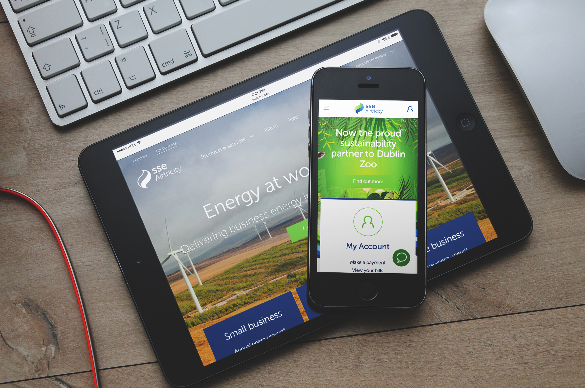
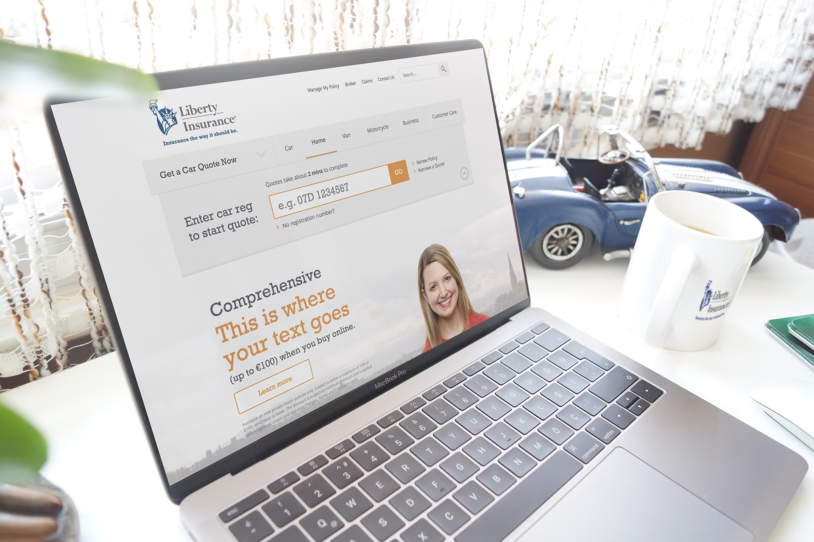
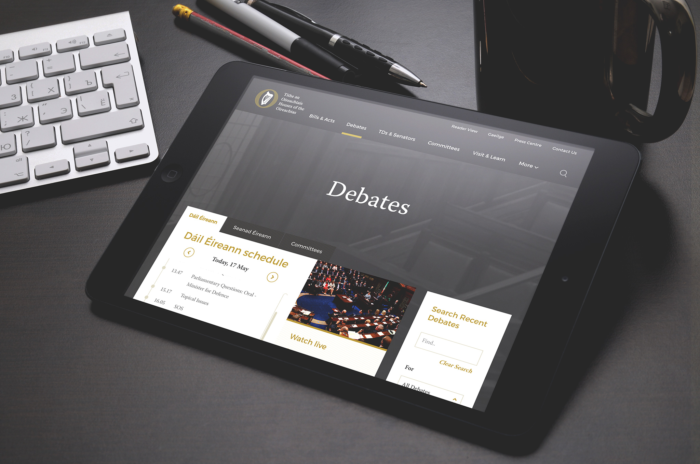

# **This is** what I do

I'm a web developer by trade. My 9-5 is currently spent as a front-end engineer for <a href="http://www.eachandother.com/people.html" target="_blank" >Each & Other</a> – a UX design and digital transformation agency in Dublin city. Back in 2006 I finished up a degree in Software Development in my home town of Galway, at the Galway-Mayo Institute of Technology, or GMIT. Since then I've bounced between the east and west coasts of Ireland, but settled in Dublin around 2012.

## Current __tech stack__

I've been using __CSS__ since about 1999. I'm very comfortable with it. I love using it to bring pages to life with micro-interactions and fluid UI animations. CSS is like crayons. Anyone can use it, but it takes a bit of skill and practice to do anything useful with it.

__JavaScript__ has been my main focus over the past few years. I've built applications with __Ember__ and __React__, and a smaller scale application with __Angular__ and __Ionic__. The latter was for a hybrid Android app you can find on the <a href="./projects">side projects page</a>. Prior to using JavaScript properly, __jQuery__ was king for most projects and gave me a nice ramp-up into using front-end JavaScript on a day-to-day basis. I use __Node__ and __NPM__ daily to handle tooling for any projects I'm working on, with __Gulp__ as a task runner. __Github__ is my preferred method of version control. The __AWS__ suite of cloud services is pretty awesome for all things cloud, and I completed the <a href="https://aws.amazon.com/training/course-descriptions/essentials/" target="_blank" >AWS Technical Essentials</a> day course last November to get a better understanding of how it can be leveraged.

## __Recent__ Projects

### SSE Airtricity

SSE's public website blah blah responsive blah blah
- responsive, lead, tooling, modular, pattern lib, onsite

  

### Ersules
- ember
- iot
- node

### Liberty Insurance
- onsite
- responsive
- modular
- php
- silverstripe

  

### Oireachtas Éireann
- onsite
- front-end

  

## __Employers,__ past and present  

- 2006 <a href="#" target="_blank" >Trust5</a> - Dublin
- 2007 <a href="#" target="_blank" >Fintrax</a> - Galway
- 2009 <a href="#" target="_blank" >Aró</a> - Galway
- 2011 <a href="#" target="_blank" >Buy4Now</a> - Dublin
- 2012 <a href="#" target="_blank" >IQ Content</a> - Dublin
- 2015 <a href="#" target="_blank" >Each & Other</a> - Dublin

  <!-- Map component? -->

## Clients

These are a few well known companies whose code I've worked on over the past few years.

- Accenture
- Allied Irish Bank
- Beverly Hills Hotel
- Dorchester Hotel
- EA Mobile
- Ersules
- Fujitsu
- Goodyear / Dunlop
- Kerry Group
- Liberty Mutual Insurance
- Oireachtas Éireann
- Raidió Teilifís Éireann
- Road Safety Authority
- SSE Airtricity
- The K Club
- Version 1
- Vodafone
