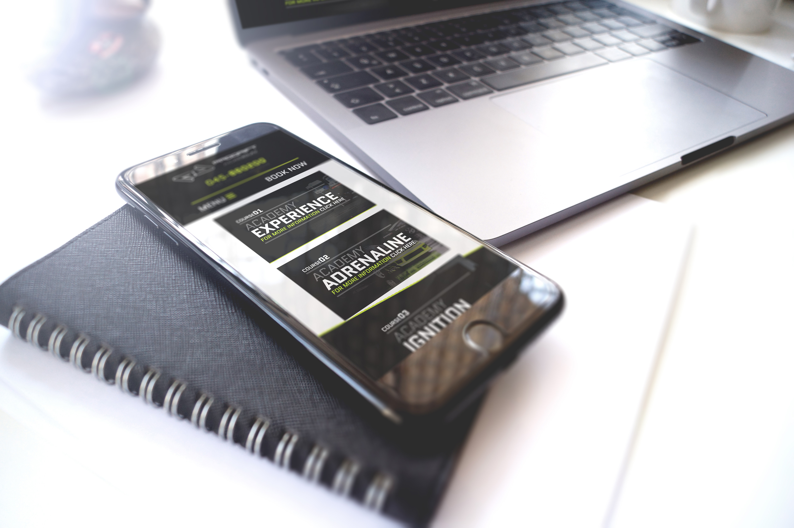
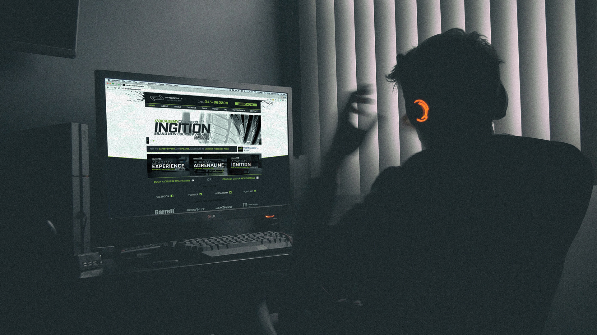

# Freelance

These are some examples of work I completed in a freelance capacity over the past few years. They range from logo and graphic design, to web design and web development.

# Web __design__ // web __development__

## Irish Drift Championship
Designed in Photoshop, developed as a Wordpress theme.

## Prodrift Academy
Designed in Photoshop, developed as a responsive Wordpress theme. Cloned for the UK and UAE.

    

    

## __Deansgrange__ Dental
Designed in browser, static website for the moment, will CMS next

## __Clear__ Dental
Designed in Photoshop, developed as a Wordpress theme.

## __Vanda__ Art Gallery
Third party Wordpress theme setup eCommerce site

# Graphic Design

Print Deansgrange Dental
Print Dealtwidth

Logo Drift2
Logo Irish Tech Community
Logo Irish Drifting Community
