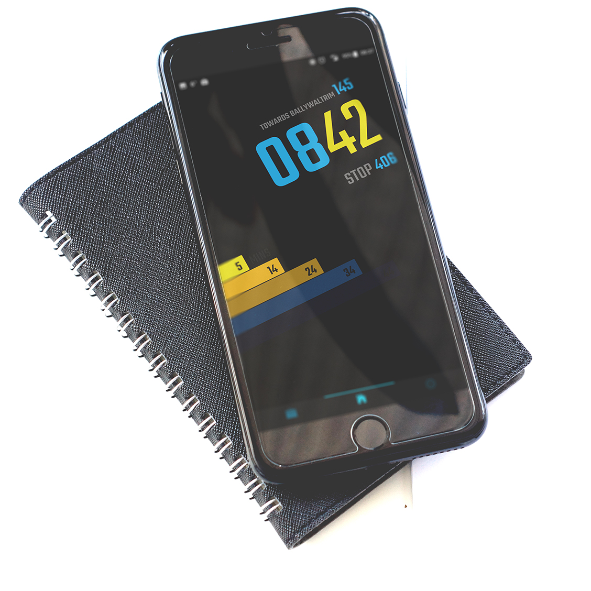

# __Pro__jects #

Projects that don't fall under freelance or my day job, live here. This is the section I want to grow this year. It's a bit bare at the moment.

### Dublin Bus - Incoming Bus app

Dublin Bus provides a free API for real time bus information. At the time I was using the bus to commute to and from work. You could get to the bus stop and find that you've missed your bus by a minute, and there won't be another for 20 minutes or more.

There's already an official Dublin Bus app for showing routes, busses, stops etc, but I wanted to make something very simple that would do one thing well. It would show you at a quick glance what busses were due, and if you needed to run like Forrest to save yourself a 30 minute wait in the rain.

    

  You have three nav buttons in the footer. The third is for settings, where you select a single route and stop number for your work commute, and the same for your home commute. The other nav buttons bring you to the incoming bus view for work and home, respectively.

This was built with the <a href="https://ionicframework.com" target="_blank" >Ionic</a> framework, which lets you build hybrid apps with JavaScript and outputs for Apple and Android. The current Android version can be downloaded from the <a href="https://play.google.com/store/apps/details?id=com.ionicframework.buswarner226622&hl=en" target="_blank" >Google Play Store</a>. I'm an Android guy and haven't splashed out for an Apple developer licence yet, but I'll update this if and when I do.

### This website

You can read all about this website over in its own section, but tldr; it's a single page React application that fetches and converts Markdown files when you navigate to different sections.

### Future Projects

I have a backlog of things I want to build, but always end up starting side projects and then taking on freelance work and not getting around to finishing the side projects. Now that I have this website up and running it will give me motivation to get more little projects completed.
