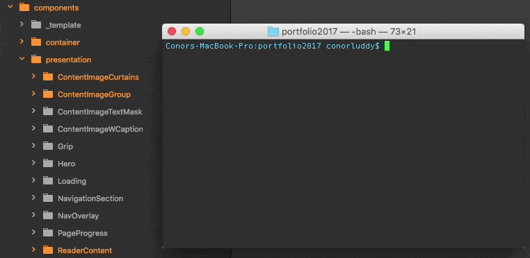

# **About** this site

The last time I had a personal website, it was sitting on Wordpress. This time I wanted to make something different...

*Warning* – nerdy dev tech stuff ahead.

## __Website__ Goals

In my head, the rough idea was this:
- Be a portfolio for my work and photography.
- Be a playground for front-end development.
- Be self-educational to build.
- Be reusable and open-sourceable.
- Be an outlet for tutorials and other content.

## __Under__ the hood

In a nutshell, this is a _single page application_ built from the ground up with React and React Router. Page content comes from markdown files, <a href="https://developer.mozilla.org/en/docs/Web/API/Fetch_API" target="_blank" >fetched</a> when you navigate around. Fetched markdown files are parsed and converted into HTML and React components on the fly.

## __Build__ system

Locally I'm using Node, with Webpack and Babel to transpile any ES6 to ES5 and bundle it up. I use BrowserSync for local development, with watch tasks to refresh the browser whenever any code or content changes. Gulp is my drug of choice for everything else.

The navigation tree for the site is built with <a href="https://www.npmjs.com/package/directory-tree" target="_blank" >directory-tree</a>. It creates a JSON object representing a directory structure. In this case it targets the content directory, which contains subdirectories for photography and development. Each of those has a bunch of MD files. The JSON file created from this process is then imported into the main bundle and React uses it to generate the page navigation. When you change content it triggers the gulp-content task, which updates all of the MD files to be published, and re-builds the directory tree and the main bundle.

### __Component__ Generator

Automate all the things. The `gulp new-component` task will prompt you for a component name, and in keeping with best practices for React development, will let you choose to make the component stateful or stateless.

Stateless components should be used for presentation, and stateful components should be used for handling data and telling their stateless child components how to behave. For same reason, stateless components should have CSS, and stateful should not. (Side-note; I'm using SASS for CSS and this is a responsive website)

The gulp generator then will also generate SASS files for stateless components. The SASS files sit in a SASS directory within it's component directory, (as opposed to the traditional way of keeping them all together in the main SASS directory). I've found this a really nice way to work because it's so quick to access the code for the component you're currently working on. Each component has a *small*, *medium* and *large* SASS file, which relates to device screen sizes.

Finally, there's a components SASS file which sits with all of the base SASS stuff (normalise, grid, typography, etc). This file is regenerated whenever you create a new component (and regenerated each time you run the default task, just in case). It indexes all of the small SASS files from each component, then drops in a breakpoint for the medium range and indexes all of those, and then does the same for large.

I do need to extend it to build unit tests too... It will happen soon.

## __Hosting__

This is a static site, so it'll happily sit on AWS via S3 and Cloudfront, with Route 53 routing my domain name to it. Deployment can be automated (read; TODO) to deploy whenever you push commits to Github.

## **Visual design** ##

I started designing this in SketchApp after creating a mood-board from various sources, and then ended up tweaking it a lot while I was building it. The aim was to be clear and minimal so that the content and photography could stand out. It's got a 50/50 split between photography and coding. I want to use it as a portfolio for both, but they're both very different disciplines. There's no logo for now because I don't have a personal brand, and it would just get in the way :)
