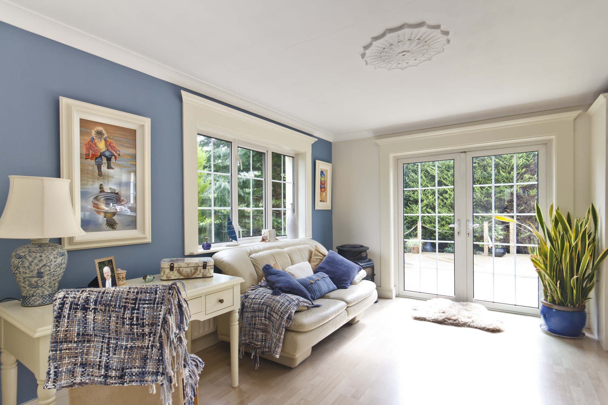
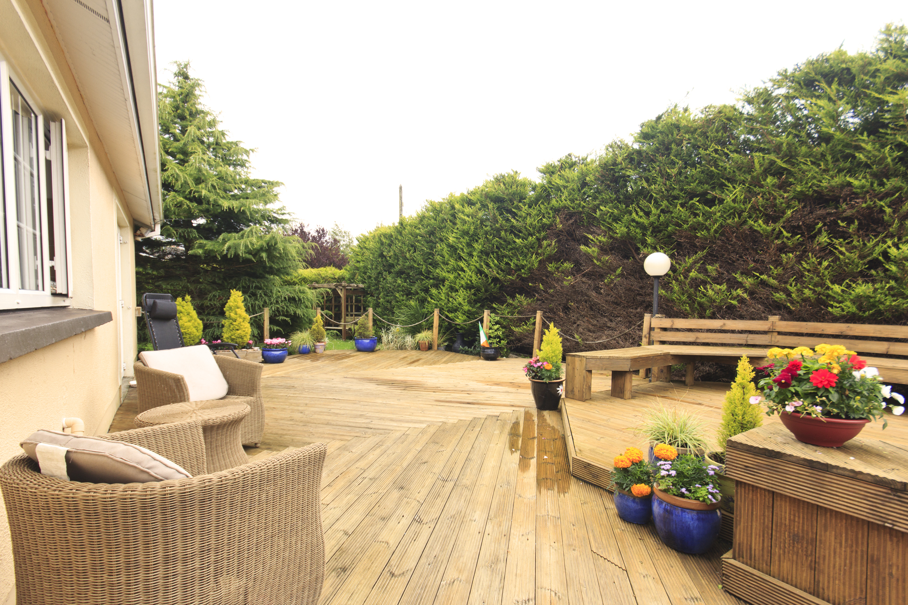
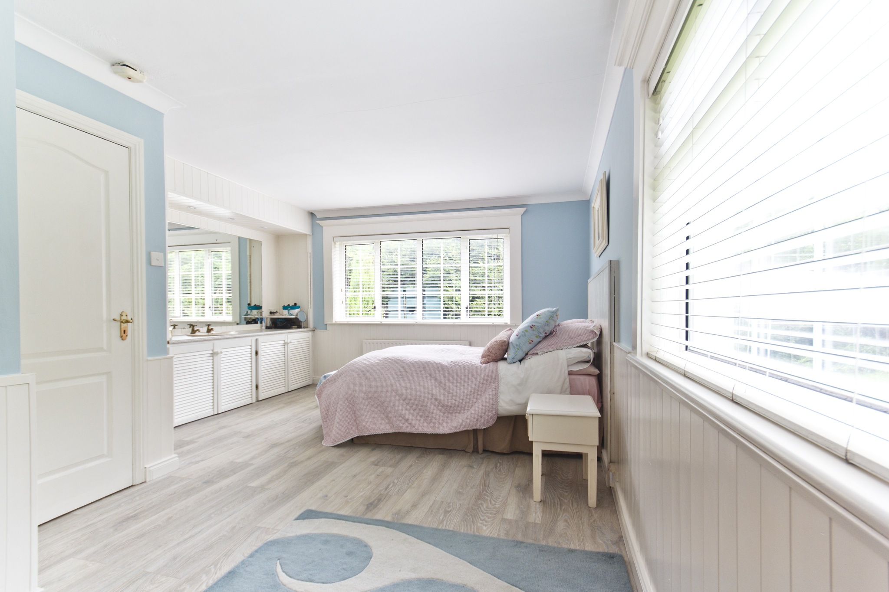
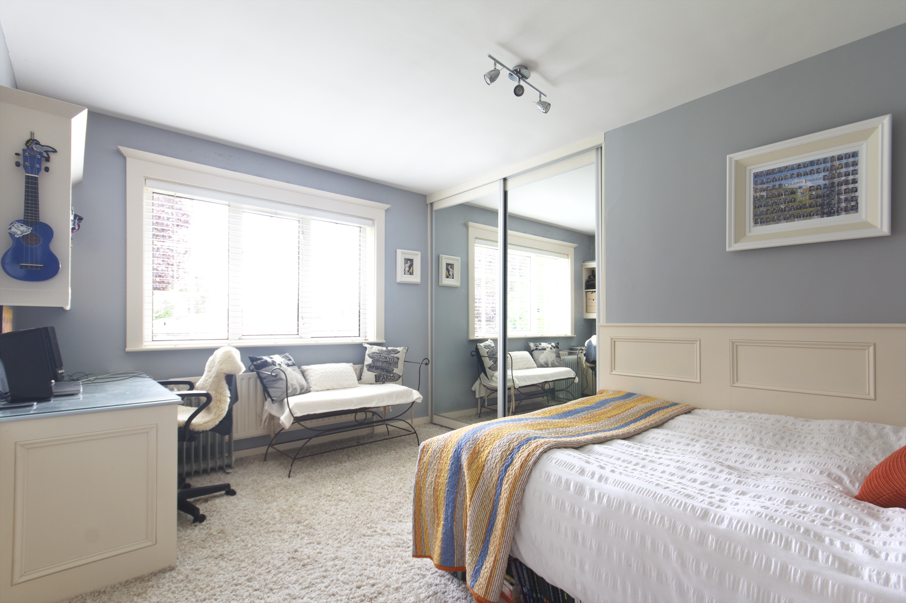

## **Property** Photography

Whether you're trying to sell your home, rent out an apartment on Daft, or entice AirBnb users to pick your pad over the hundreds of other options in the area – having a good set of photographs is crucial to make you stand out from the crowd.

Below is a selection of some property photographs I've taken to date. I'm always looking to add to this portfolio, so hit me up if you want to talk.

    

  Treehouse accommodation in Teapot Lane, Co. Leitrim. This is a 'glamping' resort near Bundoran. The treehouse has it's own stove and is super cosy.

 

 

   

 

 

 

 

 

 

