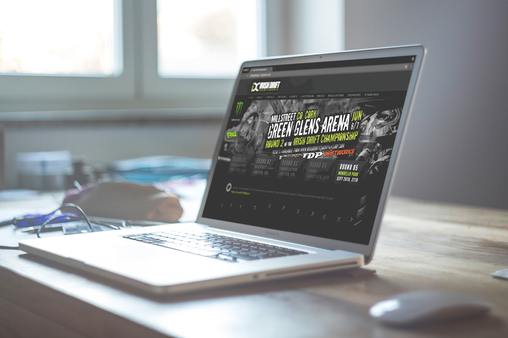
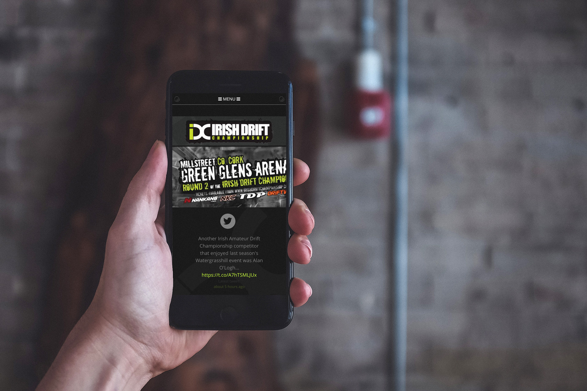
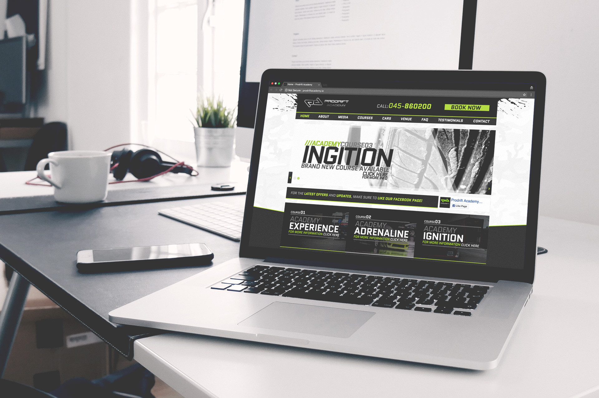
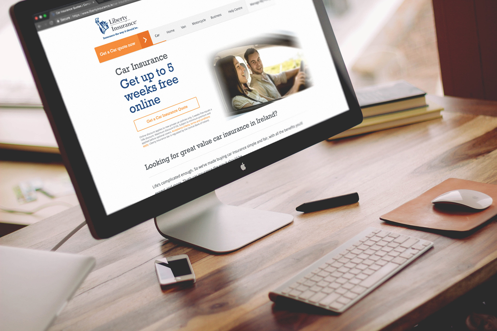
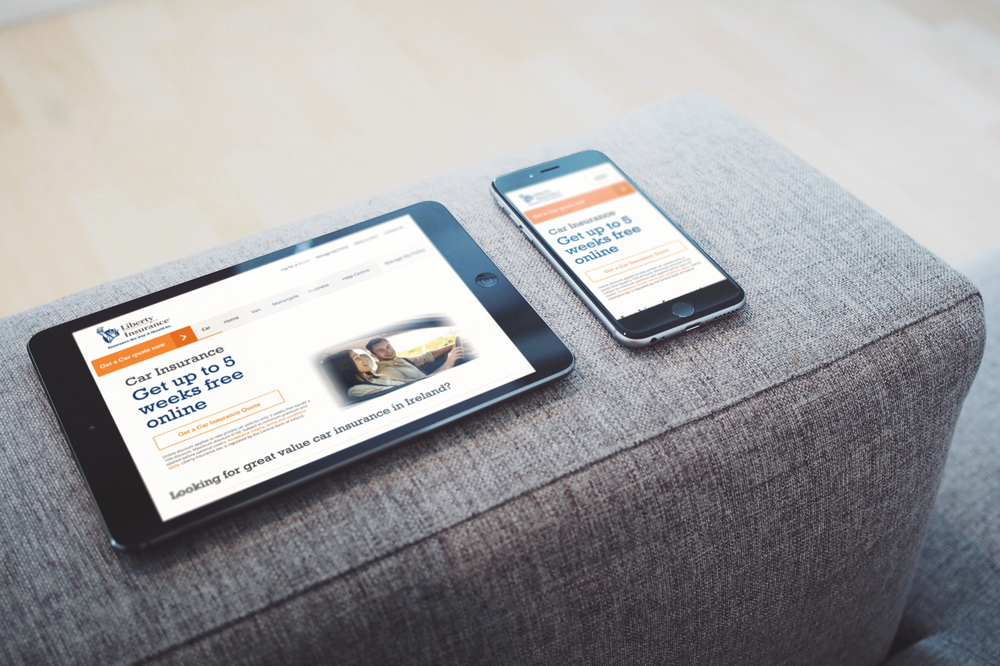
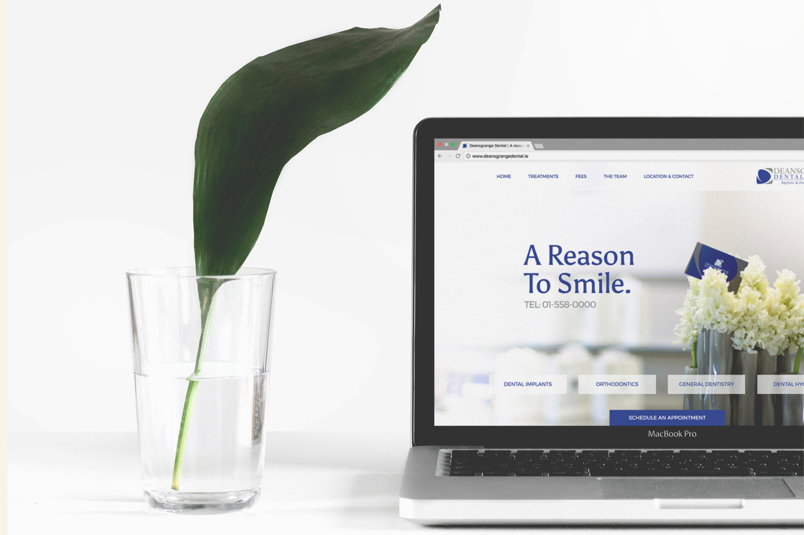
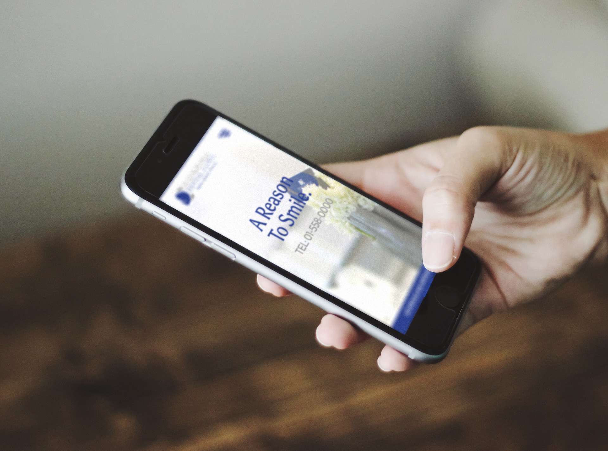
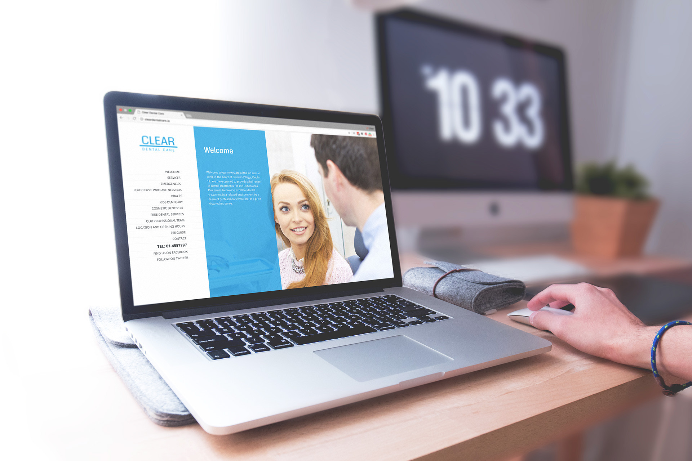
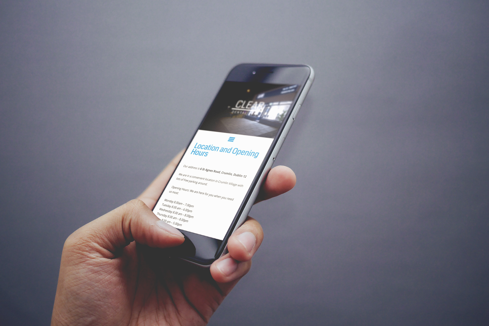

# __Web__ design // development

These are small selection of projects I've worked on over the last few years.
Web development is my full-time day job, and has been for over 10 years now.
The design side of it started out as a personal hobby that ended up turning into
something useful. Having an interest in design comes in useful very often when
you're a developer. For example – all of the designs samples on this page are photos from a
<a href="https://unsplash.com/collections/871415/mockupable" target="\_blank">collection I made on Unsplash</a>.
I made PSDs from them which I can just drop webpage screenshots into, resulting
in realistic looking mockups. I didn't learn that while coding :p

## __Irish Drift__ Championship

When I got my first DSLR camera about 7 years ago, I ended up under the wing of
a car enthusiast blog called <a href="http://freshfix.ie/" target="\_blank">Freshfix</a>. We
would cover drifting events, which meant I'd get to go out on to the actual
track during events and shoot <a href="https://vimeo.com/70743331" target="\_blank">the action</a>
up close. I ended up making loads of connections after a few years of this, and soon after I'd
<a href=https://www.behance.net/gallery/7180623/Web-Design-Development-Freshfixnet target="\_blank" >re-designed and re-built the old Freshfix website</a>,
I was asked if I'd be up for designing and building the first ever Irish Drift
Championship website. The guys running the IDC have really built it into something
insane since then and I'd recommend <a href="https://www.idcnation.com" target="\_blank">checking it out</a>.
The site I built was since retired, but it served its purpose well for the first couple of years.

- Responsive website – Works seamlessly across mobile, tablet and desktop
- Bespoke design – designed by me with Adobe Photoshop
- Wordpress theme – Built as lightweight as possible from the ground up
- LiveStream feed at events reached over 50k people at peak times
- Driver profiles pages for 100+ drivers, with filters and search

    

    

## __Prodrift__ Academy

The Irish Drift Championship was formerly known as Prodrift. These guys kept the
brand alive and run a drifting school out of Mondello. I designed and built them
a <a href="http://prodriftacademy.ie/" target="\_blank">website</a> in 2013.
The site is still in use today, 4 years later, and was also cloned for the
<a href="http://www.prodriftacademysa.com/" target="\_blank" >school they've set
up in Dubal</a>. I was also hired for a few of the drift sessions to handle
photography to be used for their social media and for their students, as well as
for certain parts of the website at the time.

- Responsive website – Works seamlessly across mobile, tablet and desktop
- Bespoke design – designed by me with Adobe Photoshop
- Wordpress theme – Built as lightweight as possible from the ground up

    

    

## __Liberty__ Insurance

Liberty hired a small team of us to design and build their current website. I was the
front-end developer for the project, so I built the front-end [CSS, JavaScript, HTML]
of their current responsive website. The aim was to make it load as quickly as possible,
as well as making it modular so that it would be quick and easy to compose new
page layouts.

    

    

## __Deansgrange__ Dental

The previous Deansgrange Dental website had been 'hacked', according to the people
who had built it for them. They were looking for a chunky sum of money to look
into it and fix it for them. It had been using a free Wordpress theme and had a
few basic pages. When I checked the server I saw that the code had just been moved
into a folder called 'hacked', so that the site couldn't load. To fix it, all they
would have had to do is take the code back out of the folder. Had it been a
malicious hack, it's doubtful that the culprits would have made it so easy to
reverse – so I'm pretty sure it was a web design shop trying to fleece a dentist.

Anyways, I designed them a new responsive website and carried out a couple of
photoshoots to provide bright imagery for it, as well as staff portraits. The
site is just static for the moment, as in it doesn't run on a CMS. This makes it
much faster than a Wordpress website though. Page speed is a major factor for
strong SEO (Search Engine Optimisation).

I built it with a modular front end and used GulpJs and SASS in my build system
so that you can easily upgrade components and all of the pages will automatically
rebuild themselves.

- Responsive website – Works seamlessly across mobile, tablet and desktop
- Bespoke design – Mostly designed in the browser
- Photography – All website photos were taken by myself

    

    

## __Clear__ Dental

Clear Dental Care are based in Crumlin, Dublin. This is a Wordpress site that I
designed around the client's vision for what they wanted. I also created their
logo and carried out a couple of photoshoots to provide photography for their
website and marketing material. One of the photos was even used for a roadside
billboard advertisement.

- Responsive website – Works seamlessly across mobile, tablet and desktop
- Photography – All website photos were taken by myself
- Bespoke design

    

    

